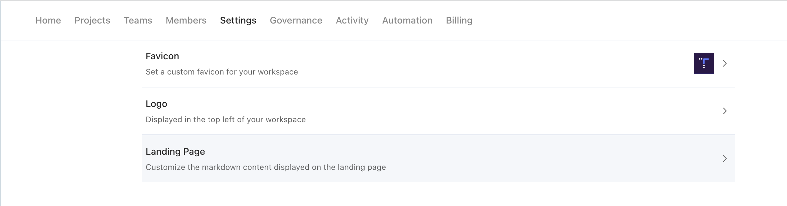

# TidepoolApi 


[](https://github.com/tidepool-org/TidepoolApi/actions/workflows/check-and-publish.yml)

This repository contains Tidepool Platform API documentation in [OpenAPI v3](https://www.openapis.org/) format with additional narrative content in [Stoplight-flavored](https://meta.stoplight.io/docs/studio/docs/Documentation/03a-stoplight-flavored-markdown.md) [CommonMark](https://commonmark.org/) format which in turn is a less ambiguous formal definition of [Markdown](https://www.markdownguide.org/).
These API definitions can be used to generate stub code for either server or client side. Currently, we only do this with the `clinic` service (see below for special note on that).

## Workflow

We have an account in [Stoplight](https://tidepool.stoplight.io) for publishing the documentation and API specifications. The goal is for that site to soon replace the current [developer portal](https://developer.tidepool.org). It *is* possible to edit the documentation files directly online in Stoplight - however we are *not* using that capability, for several reasons:

1. Doing so requires using one of a limited number of seats (5).
2. It does not fit well into our normal review/approval workflow.
3. It requires integration with GitHub with [broad scopes including access to private repositories](https://support.stoplight.io/s/article/Github-OAuth-Permissions-Overview).
4. It does not enable us to run pre-merge checks, in particular to validate changes that could break generated server stub code such as the [`clinic`](https://github.com/tidepool-org/clinic) service. See the `check` and `generate` steps in the [Makefile](./Makefile).
5. It does not enable us to run pre-processing steps necessary to consolidate multiple API specification files into a single OpenAPI v3 specification to make the published API view more coherent. See the `prepare` steps in the [Makefile](./Makefile).
6. We automatically publish two sets of API specifications from the same source files:
   1. *public* documentation that only describes APIs useful to client application developers.
   2. *private/full* documentation that describes all APIs, even ones that are only accessible to Tidepool team internal use.

The preferred workflow is to edit these files offline, then commit them to GitHub which automatically pushes updates into Stoplight, including work branches though they are not visible to people outside of Tidepool. Here are the workflow details:

1. Clone this repository and install the validation & publishing tools. You only need to to this once.

    ```shell
    git clone https://github.com/tidepool-org/TidepoolApi.git
    cd TidepoolApi
    make install_tools
    ```

2. Create a *work branch* for your edits:

    ```shell
    git checkout master
    git pull
    git checkout master -b {branch}
    ```

3. Edit and preview the files offline using any of the [tools](#editing-tools) listed below.
4. Validate your changes locally:

    ```shell
    make check
    make prepare
    ```

5. Commit your changes to the work branch and push to GitHub. This will automatically kick off a [GitHub Action](.github/workflows/) that checks & publishes the new (draft) documentation into a branch in Stoplight.

    ```shell
    git add {file(s)}
    git commit -m "{description}"
    git checkout master
    git pull
    git checkout {branch}
    git merge --no-ff master
    git push -u origin HEAD
    ```

6. Post a pull request (PR) to review the changes
7. Once the PR is approved, merge to master which will again automatically update the master branch in the Stoplight site.

It is also possible to publish your work branch to Stoplight from your local folder. You will need the API tokens for Stoplight stored in 

### Adding New Specification Files

If you add a brand new top-level OpenAPI 3.0 specification file, it needs to be added to the [`templates/openapi-merge.jsonnet`](./templates/openapi-merge.jsonnet) template file so that it gets included in the combined specification file that is published in Stoplight.

## Publishing Tokens

To publish documentation and API specifications locally, you will need the corresponding API token from Stoplight. Those API tokens are not directly found in the Stoplight project settings UI, but they are documented [here](https://docs.stoplight.io/docs/platform/f76c84240244f-publish-with-the-stoplight-cli) or if that link no longer works, [Google for it](https://www.google.com/search?q=Publish+with+Stoplight+CLI).

The tokens are configured as secrets for the GitHub Actions and can be found here:

* Token for [Public API](https://tidepool.stoplight.io/settings/tidepool-api/automation)
* Token for [Full API](https://tidepool.stoplight.io/settings/tidepool-full-api/automation)

## Landing Page

The contents in Tidepool's organization [home page](https://tidepool.stoplight.io/) in Stoplight comes from a file in this repository. To update it:

1. Edit the [landing.md](./landing.md) Markdown file.
2. Commit the changes & push to GitHub, for posterity.
3. Copy & paste the file's Markdown contents into the [Settings](https://tidepool.stoplight.io/admin/settings) page. This requires admin permissions in Stoplight.



## Editing Tools

1. Free [Stoplight Studio](https://stoplight.io/studio/). This is the recommended tool since it is the closest rendering to the publishing site.
2. Free Microsoft [Visual Studio Code](https://code.visualstudio.com/), with plug-ins for validating and rendering OpenAPI v3 specifications and Markdown documentation.
3. Many other IDEs offer similar plug-ins.

## Other Tools

The [Makefile](./Makefile) makes use of several CLI tools to check, prepare, and publish the documentation and specifications.
You can install the tools by executing the following command:

```shell
make install_tools
```

You can check if you have all the tools installed by executing the following command:

```shell
make check_tools
```

| Tool | Description |
|------|-------------|
| [markdownlint](https://www.npmjs.com/package/markdownlint) | Validates Markdown files. |
| [markdown-link-check](https://www.npmjs.com/package/markdown-link-check) | Validates hyperlinks in Markdown files. |
| [spectral](https://www.npmjs.com/package/@stoplight/spectral) | Validates OpenAPI 3.0 specification files. |
| [swagger-cli](https://www.npmjs.com/package/swagger-cli) | Validates OpenAPI 3.0 specification files. Also bundles multiple OAS3 files into a single file, that is required by some downstream use-cases. |
| [redocly](https://github.com/Redocly/redocly-cli) | Validates OpenAPI 3.0 specification files. Also bundles multiple OAS3 files into a single file, that is required by some downstream use-cases. |
| [jsonnet](https://jsonnet.org/) | Data templating tool. Used here to generate the configuration file for `openapi-merge-cli`. |
| [openapi-merge-cli](https://www.npmjs.com/package/openapi-merge-cli) | Merges OpenAPI 3.0 specification files into single file. |
| [stoplight](https://www.npmjs.com/package/@stoplight/cli) | Publishes OpenAPI 3.0 specifications and documentation in Markdown format to Stoplight's web site. |
| [oapi-codegen](https://github.com/deepmap/oapi-codegen) | Generates server and client stub code from OpenAPI 3.0 specifications. Used currently to generate the [`clinic`](https://github.com/tidepool-org/clinic) service code. |
