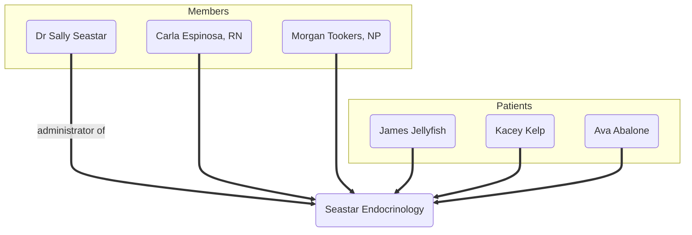
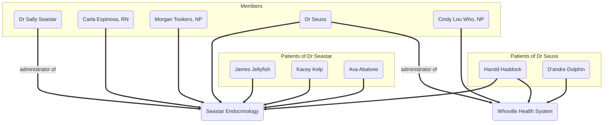

<!-- omit in toc -->
# Clinic Integration Guide

<!-- omit in toc -->
## Table of Contents

1. [Introduction](#introduction)
   1. [Clinic Data Model](#clinic-data-model)
2. [Authentication](#authentication)
3. [Common Use Cases](#common-use-cases)
   1. [Identify Current User](#identify-current-user)
   2. [Enumerate Clinics](#enumerate-clinics)
   3. [Enumerate Clinic Staff Members](#enumerate-clinic-staff-members)
   4. [Enumerate Patients](#enumerate-patients)
   5. [Search for a Patient](#search-for-a-patient)
   6. [Fetch Patient Record](#fetch-patient-record)
   7. [Fetch Patient Data](#fetch-patient-data)
   8. [Update Patient Record](#update-patient-record)

---

## Introduction

This guide is for clinics who are interested in retrieving clinic or patient data programmatically from Tidepool Data Platform. That can be done in two ways:

1. EHR integrations with [Health Level Seven (HL7)](https://www.hl7.org) and [Fast Healthcare Interoperability Resources (FIHR)](https://hl7.org/fhir/) through middleware partners [Redox](https://redoxengine.com/) and [Xealth](https://www.xealth.com/). This feature is part of our [Tidepool+ offering](https://www.tidepool.org/providers/tidepoolplus) that requires a paid subscription.
2. Tidepool Data Platform exposes a rich set of REST APIs that may be used to directly interact with Tidepool data model. These are the same APIs that are used by Tidepool's own applications.

If you are interested in EHR integration, please contact Tidepool Sales team. This guide focuses on the latter use-case.

The intended audience for this guide are information technology teams or software developers who may be asked to evaluate and implement the direct API integration. For brevity, this guide assumes you are experienced with common web technologies such as OpenID Connect, OAuth2 and REST APIs.

### Clinic Data Model

Before diving into sample use-cases, let's walk through an overview of how clinics, clinicians, patients and patient data is structured in Tidepool Data Platform.

There are 3 basic data types in the clinic data model: *clinics*, *members*, and *patients*.

* *Clinic*: represents a healthcare organization, such as a clinic or hospital.
* *Member*: staff member of one or more clinics. Each member has a role that is specific to each clinic:
  * Administrator: member with administrator privileges, i.e. change clinic settings, add or remove clinicians or administrators, and so on. Every clinic has at least one administrator.
  * Clinician: member without administrator privileges.
* *Patient*: person with diabetes who is a patient of one or more clinics. They can be further sub-divided into two categories:
  * *Custodial Patient*: a patient who was created by the clinic, and has not accessed their patient account outside of that clinic.
  * *Claimed Patient*: a patient who either created their own account and shared it with a clinic, or accepted an invitation from a clinic to claim a custodial patient account created by that clinic.

Both members and patients may be part of multiple clinics. That is, there exists a one-to-many relationship between them and clinics.

Here is a simple diagram to illustrate this data model. *Dr Seastar* manages her *Seastar Endocrinology* clinic with 2 other members and 3 patients.



Here is somewhat more complicated sample diagram. *Dr Seuss* manages his own *Whoville Health System*, but occasionally helps out his friend *Dr Seastar* at the *Seastar Endocrinology*. He has administrator role in his own clinic, and only normal clinician role in *Seastar Endocrinology*. One of his patients, *Harold Haddock*, is also a patient of *Seastar Endocrinology*.



## Authentication

All Tidepool Data Platform APIs require a valid access token. The process to acquire an access token is described in greater detail in a separate [authentication guide](./authentication.md). Note that depending on the origin of the access token, they may be fairly short-lived: you will need to refresh the token once it expires.

You login to your user account which in turn may be member of any number of clinics. Your membership in those clinics grants you access to the clinic data, and any patients of each clinic.

## Common Use Cases

### Identify Current User

Many API calls require your Tidepool user ID as part of the URL. This is ether a 10-digit hexadecimal number (legacy) or an UUID (new) that uniquely identifies the user within Tidepool. It is an immutable value that never changes even if your email address changes. You can retrieve it along with the rest of your user account metadata with this API:

```shell
curl -X GET -H "X-Tidepool-Session-Token: {access_token}" "https://app.tidepool.org/auth/user"
```

You will need the user ID (the `userid` field) of the account:

```json
{
    "emailVerified": true,
    "emails": [
        "demo+drseastar@tidepool.org"
    ],
    "roles": [
        "clinician",
        "default-roles-tidepool"
    ],
    "termsAccepted": "2017-04-25T22:34:30+00:00",
    "userid": "cbd70cabd8",
    "username": "demo+drseastar@tidepool.org"
}
```

### Enumerate Clinics

As mentioned above, a member can belong to any number of clinics. You can enumerate the list of clinics. By default, this API returns the first 10 clinics. If the clinic list is longer, you'll need to use the optional `offset` and/or `limit` parameters.

```shell
curl -X GET -H "X-Tidepool-Session-Token: {access_token}" "https://app.tidepool.org/v1/clinicians/{userId}/clinics?offset={start}&limit={limit}"
```

You will need the clinic ID (the `id` field) for a given clinic to fetch more data about that clinic's members or patients.

```json
[
    {
        "clinic": {
            "address": "123 Milly Mole Lane",
            "canMigrate": false,
            "city": "Palo Alto",
            "clinicType": "provider_practice",
            "country": "US",
            "createdTime": "2024-11-29T13:28:58.561Z",
            "id": "6749c19a2169780db2894303",
            "name": "Seastar Pediatric Endocrinology",
            "postalCode": "94301",
            "preferredBgUnits": "mg/dL",
            "shareCode": "JDZY-KS2F-AR8T",
            "state": "CA",
            "tier": "tier0100",
            "tierDescription": "Free",
            "updatedTime": "2024-11-29T15:00:26.913Z",
            "website": ""
        },
        "clinician": {
            "createdTime": "2024-11-29T14:55:28.498Z",
            "email": "demo+drseastar@tidepool.org",
            "id": "cbd70cabd8",
            "name": "Sally Seastar",
            "roles": [
                "CLINIC_ADMIN"
            ],
            "updatedTime": "2024-11-29T14:59:22.027Z"
        }
    },
    {
        "clinic": {
            "address": "123 Milly Mole Lane",
            "canMigrate": false,
            "city": "Blacksburg",
            "clinicSize": "250-499",
            "clinicType": "provider_practice",
            "country": "US",
            "createdTime": "2022-01-06T17:54:03Z",
            "id": "61d72cbb4faea5d2c9b608c2",
            "name": "Seastar Endocrinology",
            "patientTags": [
                {
                    "id": "635c1d0b776e61e410de6346",
                    "name": "Pregnant"
                },
                {
                    "id": "635c1d1a8ddfbdd65bb73f14",
                    "name": "CGM Start"
                },
                {
                    "id": "635c1d388ddfbdd65bb73f15",
                    "name": "Type 2"
                },
                {
                    "id": "635c1e64776e61e410de634b",
                    "name": "Type 1"
                },
                {
                    "id": "63865e2f776e61e410de78c1",
                    "name": "College"
                },
                {
                    "id": "638fa5048ddfbdd65bb758aa",
                    "name": "Extra Care"
                },
                {
                    "id": "640b40127623a9bf2d179d85",
                    "name": "Dr Seastar"
                },
                {
                    "id": "640b40177623a9bf2d179d86",
                    "name": "Dr Quinn"
                },
                {
                    "id": "640b40387623a9bf2d179d87",
                    "name": "Dr Seuss"
                },
            ],
            "postalCode": "24061",
            "preferredBgUnits": "mg/dL",
            "shareCode": "A45F-F8JJ-CS6S",
            "state": "VA",
            "suppressedNotifications": {},
            "tier": "tier0300",
            "tierDescription": "Premium",
            "updatedTime": "2025-02-18T21:03:49.923Z",
            "website": "https://tidepool.org"
        },
        "clinician": {
            "createdTime": "2022-01-06T17:54:03.242Z",
            "email": "demo+drseastar@tidepool.org",
            "id": "cbd70cabd8",
            "name": "Dr. Sally Seastar",
            "roles": [
                "CLINIC_ADMIN"
            ],
            "updatedTime": "2022-01-06T17:54:03.242Z"
        }
    }
]
```

### Enumerate Clinic Staff Members

Once you have a clinic ID, you can fetch the list of members (administrators, clinicians) of that clinic:

```shell
curl -X GET -H "X-Tidepool-Session-Token: {access_token}" "https://app.tidepool.org/v1/clinics/{clinicId}?offset={start}&limit={limit}"
```

```json
[
    {
        "createdTime": "2023-05-04T13:17:43.862Z",
        "email": "demo+yertle@tidepool.org",
        "id": "674703f4-eb4b-407f-9120-8564ae2b652b",
        "name": "Yertle Turtle",
        "roles": [
            "CLINIC_MEMBER"
        ],
        "updatedTime": "2023-05-04T13:19:58.604Z"
    },
    {
        "createdTime": "2022-02-14T19:26:37.144Z",
        "email": "demo+drseastar@tidepool.org",
        "id": "cbd70cabd8",
        "name": "Sally Seastar",
        "roles": [
            "CLINIC_ADMIN"
        ],
        "updatedTime": "2022-02-14T19:26:47.983Z"
    },
    {
        "createdTime": "2022-02-14T19:23:11.861Z",
        "email": "demo+drseuss@tidepool.org",
        "id": "eaeebec366",
        "name": "Dr. Seuss",
        "roles": [
            "CLINIC_ADMIN"
        ],
        "updatedTime": "2022-02-14T19:23:11.861Z"
    }
]
```

### Enumerate Patients

You can enumerate the patient list of a clinic. This API also allows you to sort the resulting list by many different fields. The API reference documentation contains full details of all allowed parameter values.

```shell
curl -X GET -H "X-Tidepool-Session-Token: {access_token}" "https://app.tidepool.org/v1/clinics/{clinicId}/patients?offset={start}&limit={limit}"
```

The resulting patient list may be quite large due to the inclusion of summary data fields for each patient (depends on the clinic's tier). You'll need the patient user ID (the `id` field) to fetch data for that patient, or make changes to their patient record.

```json
{
    "data": [
        {
            "birthDate": "1984-08-24",
            "createdTime": "2022-06-15T18:59:55.773Z",
            "dataSources": null,
            "email": "demo+james@tidepool.org",
            "fullName": "James Jellyfish",
            "id": "d02b85e6b3",
            "mrn": "12345",
            "permissions": {
                "note": {},
                "upload": {},
                "view": {}
            },
            "reviews": [],
            "summary": {
                "bgmStats": {
                    "config": {
                        "highGlucoseThreshold": 10,
                        "lowGlucoseThreshold": 3.9,
                        "schemaVersion": 4,
                        "veryHighGlucoseThreshold": 13.9,
                        "veryLowGlucoseThreshold": 3
                    },
                    "dates": {
                        "firstData": "2024-12-11T15:00:00Z",
                        "hasFirstData": true,
                        "hasLastData": true,
                        "hasLastUploadDate": true,
                        "hasOutdatedSince": false,
                        "lastData": "2025-02-09T14:41:08Z",
                        "lastUpdatedDate": "2025-02-11T17:26:59.49Z",
                        "lastUpdatedReason": [
                            "LEGACY_DATA_ADDED"
                        ],
                        "lastUploadDate": "2025-02-11T17:25:13.555Z"
                    },
                    "offsetPeriods": {
                        "14d": {
                            "averageDailyRecords": 0.7142857142857143,
                            "averageDailyRecordsDelta": 0.6428571428571429,
                            "averageGlucoseMmol": 9.902534416025231,
                            "averageGlucoseMmolDelta": 6.738608061129277,
                            "hasAverageDailyRecords": true,
                            "hasAverageGlucoseMmol": true,
                            "hasTimeInAnyHighPercent": true,
                            "hasTimeInAnyHighRecords": true,
                            "hasTimeInAnyLowPercent": true,
                            "hasTimeInAnyLowRecords": true,
                            "hasTimeInExtremeHighPercent": true,
                            "hasTimeInExtremeHighRecords": true,
                            "hasTimeInHighPercent": true,
                            "hasTimeInHighRecords": true,
                            "hasTimeInLowPercent": true,
                            "hasTimeInLowRecords": true,
                            "hasTimeInTargetPercent": true,
                            "hasTimeInTargetRecords": true,
                            "hasTimeInVeryHighPercent": true,
                            "hasTimeInVeryHighRecords": true,
                            "hasTimeInVeryLowPercent": true,
                            "hasTimeInVeryLowRecords": true,
                            "hasTotalRecords": true,
                            "timeInAnyHighPercent": 0.2,
                            "timeInAnyHighPercentDelta": 0.2,
                            "timeInAnyHighRecords": 2,
                            "timeInAnyHighRecordsDelta": 2,
                            "timeInAnyLowPercent": 0,
                            "timeInAnyLowPercentDelta": -1,
                            "timeInAnyLowRecords": 0,
                            "timeInAnyLowRecordsDelta": -1,
                            "timeInExtremeHighPercent": 0,
                            "timeInExtremeHighPercentDelta": -0,
                            "timeInExtremeHighRecords": 0,
                            "timeInExtremeHighRecordsDelta": 0,
                            "timeInHighPercent": 0.2,
                            "timeInHighPercentDelta": 0.2,
                            "timeInHighRecords": 2,
                            "timeInHighRecordsDelta": 2,
                            "timeInLowPercent": 0,
                            "timeInLowPercentDelta": -1,
                            "timeInLowRecords": 0,
                            "timeInLowRecordsDelta": -1,
                            "timeInTargetPercent": 0.8,
                            "timeInTargetPercentDelta": 0.8,
                            "timeInTargetRecords": 8,
                            "timeInTargetRecordsDelta": 8,
                            "timeInVeryHighPercent": 0,
                            "timeInVeryHighPercentDelta": -0,
                            "timeInVeryHighRecords": 0,
                            "timeInVeryHighRecordsDelta": 0,
                            "timeInVeryLowPercent": 0,
                            "timeInVeryLowPercentDelta": -0,
                            "timeInVeryLowRecords": 0,
                            "timeInVeryLowRecordsDelta": 0,
                            "totalRecords": 10,
                            "totalRecordsDelta": 9
                        },
                        "1d": {
                            // omitted for brevity
                        },
                        "30d": {
                            // omitted for brevity
                        },
                        "7d": {
                            // omitted for brevity
                        }
                    },
                    "periods": {
                        "14d": {
                            // omitted for brevity
                        },
                        "1d": {
                            // omitted for brevity
                        },
                        "30d": {
                            // omitted for brevity
                        },
                        "7d": {
                            // omitted for brevity
                        }
                    },
                    "totalHours": 1440
                },
                "cgmStats": {
                    "config": {
                        "highGlucoseThreshold": 10,
                        "lowGlucoseThreshold": 3.9,
                        "schemaVersion": 4,
                        "veryHighGlucoseThreshold": 13.9,
                        "veryLowGlucoseThreshold": 3
                    },
                    "dates": {
                        "firstData": "2024-12-13T18:00:00Z",
                        "hasFirstData": true,
                        "hasLastData": true,
                        "hasLastUploadDate": true,
                        "hasOutdatedSince": false,
                        "lastData": "2025-02-11T17:21:15Z",
                        "lastUpdatedDate": "2025-02-11T17:27:27.308Z",
                        "lastUpdatedReason": [
                            "LEGACY_DATA_ADDED",
                            "LEGACY_UPLOAD_COMPLETED"
                        ],
                        "lastUploadDate": "2025-02-11T17:26:20.073Z"
                    },
                    "offsetPeriods": {
                        "14d": {
                            // omitted for brevity
                        },
                        "1d": {
                            // omitted for brevity
                        },
                        "30d": {
                            // omitted for brevity
                        },
                        "7d": {
                            // omitted for brevity
                        }
                    },
                    "periods": {
                        "14d": {
                            // omitted for brevity
                        },
                        "1d": {
                            // omitted for brevity
                        },
                        "30d": {
                            // omitted for brevity
                        },
                        "7d": {
                            // omitted for brevity
                        }
                    },
                    "totalHours": 1440
                }
            },
            "tags": null,
            "targetDevices": [
                "onetouchverioiq",
                "tandem"
            ],
            "updatedTime": "2024-01-10T13:17:39.198Z"
        },
        {
            "birthDate": "1993-04-19",
            "createdTime": "2023-04-13T17:18:46.768Z",
            "dataSources": null,
            "email": "demo+jessica@tidepool.org",
            "fullName": "Jessica Jellyfish",
            "id": "7d7c8c54-640d-4316-a713-0690851af67e",
            "mrn": "44951",
            "permissions": {
                "custodian": {},
                "note": {},
                "upload": {},
                "view": {}
            },
            "reviews": [],
            "summary": {
                "bgmStats": {
                    "config": {
                        "highGlucoseThreshold": 10,
                        "lowGlucoseThreshold": 3.9,
                        "schemaVersion": 4,
                        "veryHighGlucoseThreshold": 13.9,
                        "veryLowGlucoseThreshold": 3
                    },
                    "dates": {
                        "firstData": "2023-08-21T20:00:00Z",
                        "hasFirstData": true,
                        "hasLastData": true,
                        "hasLastUploadDate": true,
                        "hasOutdatedSince": false,
                        "lastData": "2023-10-19T13:43:05Z",
                        "lastUpdatedDate": "2024-07-19T07:23:27.301Z",
                        "lastUpdatedReason": [
                            "SCHEMA_MIGRATION"
                        ],
                        "lastUploadDate": "2023-10-23T14:28:08.107Z"
                    },
                    "offsetPeriods": {
                        "14d": {
                            // omitted for brevity
                        },
                        "1d": {
                            // omitted for brevity
                        },
                        "30d": {
                            // omitted for brevity
                        },
                        "7d": {
                            // omitted for brevity
                        }
                    },
                    "periods": {
                        "14d": {
                            // omitted for brevity
                        },
                        "1d": {
                            // omitted for brevity
                        },
                        "30d": {
                            // omitted for brevity
                        },
                        "7d": {
                            // omitted for brevity
                        }
                    },
                    "totalHours": 1410
                }
            },
            "tags": null,
            "targetDevices": [
                "onetouchverioiq"
            ],
            "updatedTime": "2023-10-23T14:18:15.829Z"
        },
    ],
    "meta": {
        "count": 2
    }
}
```

### Search for a Patient

The API for searching for patients is the same as for enumerating patients, with the addition of a `search` parameter. It allows you to search the patient list for a match with a fuzzy search term that matches names, emails, or medical record numbers (MRNs).

```shell
curl -X GET -H "X-Tidepool-Session-Token: {access_token}" "https://app.tidepool.org/v1/clinics/{clinicId}/patients?offset={start}&limit={limit}&search={search_term}"
```

The resulting patient list has the same format as the previous example, omitted here for brevity.

### Fetch Patient Record

If you know the user ID of a patient, you can fetch their patient record directly.

```shell
curl -X GET -H "X-Tidepool-Session-Token: {access_token}" "https://app.tidepool.org/v1/clinics/{clinicId}/patients/{patientUserId}"
```

The resulting patient record has the same format as one element of the data array in the previous examples, omitted here for brevity.

### Fetch Patient Data

You can fetch the individual diabetes data points for any given patient by invoking the data API. The start and end dates are ISO8601 formatted dates, and the data type list is a comma-separated list of data types you want to fetch. The full list of data types is `cbg,smbg,basal,bolus,wizard,food,cgmSettings,deviceEvent,dosingDecision,insulin,physicalActivity,pumpSettings,reportedState,upload,water`.

```shell
curl -X GET -H "X-Tidepool-Session-Token: {access_token}" "https://app.tidepool.org/data/{userId}?startDate={startDate}&endDate={endDate}&type={dataTypesList}"
```

This is only a short example of the response. The API reference documentation contains full details of each data type.

```json
[
    {
        "_deduplicator": {
            "hash": "/4YSyroSK6Qa/nrvaBV7OZyAhoAPpGcnfHCyZD40mco="
        },
        "deviceId": "Tidepool Testing Meter",
        "id": "4aedcd3b5c3a2569bbd71e5c7905766c",
        "revision": 1,
        "time": "2023-02-27T14:45:32Z",
        "type": "smbg",
        "units": "mmol/L",
        "uploadId": "704de0e907136fc152cde36c495b06f4",
        "value": 12.49991
    },
    {
        "_deduplicator": {
            "hash": "aWfjiZE4Nmt7Mtk8N3Matkd3qJecRjiwvzPHiTQx/eY="
        },
        "deviceId": "Tidepool Testing Meter",
        "id": "a43183fafd474677015acb7a0f3ca07e",
        "revision": 1,
        "time": "2023-02-27T09:18:32Z",
        "type": "smbg",
        "units": "mmol/L",
        "uploadId": "704de0e907136fc152cde36c495b06f4",
        "value": 14.32278
    },
    {
        "_deduplicator": {
            "hash": "t52k0mUvH+02WsrG80K3rHImlhx16ViWFgdbeKFqucQ="
        },
        "deviceId": "Tidepool Testing Meter",
        "id": "7a3f16e5d073b21e0cf5ab6198910967",
        "revision": 1,
        "time": "2023-02-27T04:50:32Z",
        "type": "smbg",
        "units": "mmol/L",
        "uploadId": "704de0e907136fc152cde36c495b06f4",
        "value": 15.9436
    },
]
```

### Update Patient Record

You can update a patient record by making a PUT request (rather than a GET) on the patient. Note however:

* Only some fields such as name, birth date, email, or MRN may be updated. Others are read-only.
* The update may fail if the field values violate validation rules.

```shell
curl -X PUT -H "X-Tidepool-Session-Token: {access_token}" -H "Content-Type: application/json" -d '{patient_record}' "https://app.tidepool.org/v1/clinics/{clinicId}/patients/{patientUserId}"
```
