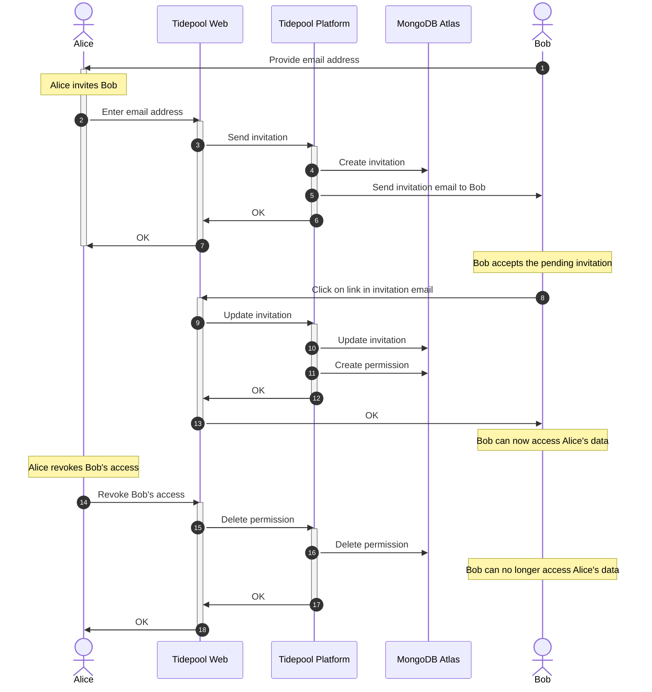

<!-- omit in toc -->
# Tidepool User Shares Their Data with a Person

## Introduction

Alice (person with diabetes) wants to share *her* diabetes data with Bob. Bob could be anyone she trusts: spouse, parent, family member or a clinician. She can revoke that access permission at any time, and there is no limit to the number of sharing relationships.

If Bob does not yet have a Tidepool account, he will have to create one before he can accept the invitation from Alice. Bob can only access Alice's data while he is successfully authenticated to Tidepool.

## Flow

