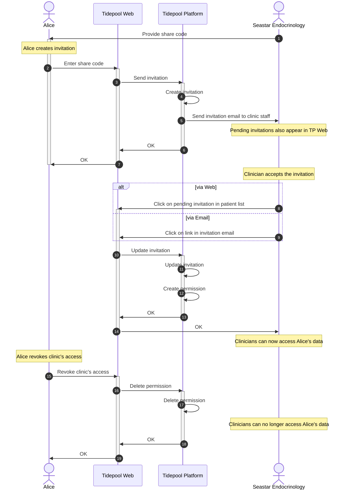

<!-- omit in toc -->
# Tidepool User Shares Their Data with a Clinic

## Introduction

Sharing data with a clinic works for the most part exactly like sharing data with a person. However, instead of using an email address, the sharing relationship is initiated with a *share code*: a randomly generated sequence of 12 alphanumeric letters from the set `ABCDEFGHJKLMNPQRSTUVWXYZ23456789`, in 3 groups separated by dashes like `XXXX-YYYY-ZZZZ`. Note that the letters `I` and `O`, and the digits `0` and `1` are excluded to reduce ambiguity.

The other difference is that sharing data with a clinic grants access to all members of that clinic, rather than individual clinicians.

## Flow

