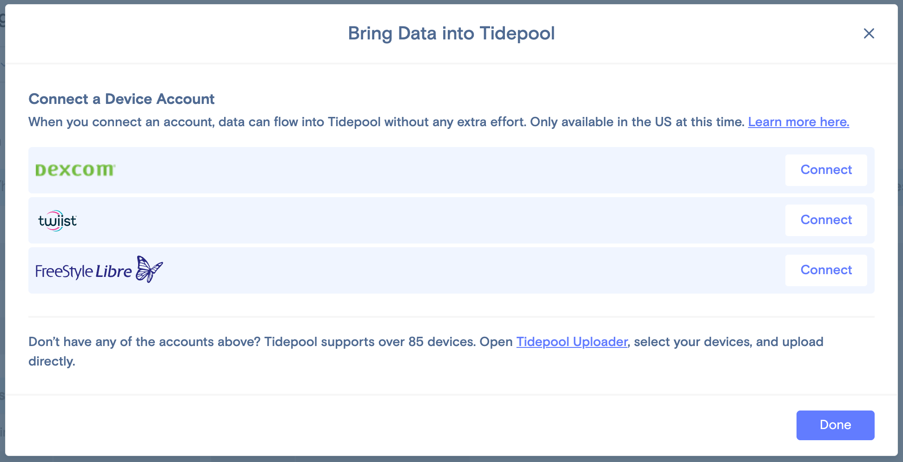

<!-- omit in toc -->
# Partner Integration Guide

<!-- omit in toc -->
## Table of Contents

1. [Overview](#overview)
2. [Device Data Model](#device-data-model)
   1. [Common Fields](#common-fields)
   2. [CGM Devices](#cgm-devices)
   3. [Insulin Delivery Devices (Pumps, Pens)](#insulin-delivery-devices-pumps-pens)
      1. [Basal Insulin](#basal-insulin)
      2. [Bolus Insulin](#bolus-insulin)
3. [Setup](#setup)
4. [Authentication and Authorization](#authentication-and-authorization)
5. [Data Transfer](#data-transfer)
6. [Revocation](#revocation)

---

## Overview

Tidepool Data Platform supports direct import of data from over [70 different types of devices](https://www.tidepool.org/devices). In addition, it has an existing integration with [Dexcom Clarity](https://clarity.dexcom.com/) as a passive and automatic *data source*. Users can continue to upload data to their Dexcom Clarity account. When they connect their Tidepool account to Dexcom Clarity, Tidepool will automatically [fetch data from Dexcom Clarity](https://developer.dexcom.com/) into the user's Tidepool account, without the user having to upload it to both Dexcom and Tidepool separately. Tidepool expects to add other cloud-connected devices as passive, automatic data sources, including other CGM and insulin delivery devices (pumps and pens) via cloud-to-cloud API connection.

This guide is to help potential partners who are interested in integrating their cloud service as a passive upload data source to Tidepool Data Platform. Tidepool uses standard [OAuth2](https://tools.ietf.org/html/rfc6749) authentication and authorization flows to enable secure 3rd party integrations with Tidepool Data Platform itself. We assume, but do not require, that the partner site uses OAuth2 as well.

For brevity, this guide assumes familiarity with OAuth technology but is not a comprehensive introduction to OAuth 2.0. The following references provide more detailed information on the principles and implementation of OAuth 2.0:

* [OAuth - RFC 7649](https://tools.ietf.org/html/rfc6749)
* [An Introduction to OAuth 2](https://www.digitalocean.com/community/tutorials/an-introduction-to-oauth-2)
* [OAuth 2 Simplified](https://aaronparecki.com/2012/07/29/2/oauth2-simplified)
* [OAuth 2.0 Servers](https://www.oauth.com/)

## Device Data Model

Tidepool will do the work of mapping from the partner's specific data model into the Tidepool data model, but here is the core set of data elements that Tidepool expects the partner site to expose via its API.

### Common Fields

Tidepool expects to receive the following data fields for each uploaded device:

| Description              | Notes                                                                         | Tidepool Data Model Field | Example(s)                                 |
| ------------------------ | ----------------------------------------------------------------------------- | ------------------------- | ------------------------------------------ |
| Device Identifier        | Globally unique to this device type and repeatable/immutable with each upload | `deviceId`                | `DexG4RecwitShaSM62228608`, `ACMEPumpCo`   |
| Device Model Name        |                                                                               | `deviceModel`             | `DexcomG6`, `ACMEPumpModel123`             |
| Device Manufacturer Name |                                                                               | `deviceManufacturer`      | `Dexcom`, `ACME`                           |
| Device Display Name      | If not provided, combine Device Manufacturer and Model Names                  | `deviceName`              | `Dexcom G6`, `ACMEPumpCo ACMEPumpModel123` |
| Device Serial Number     |                                                                               | `deviceSerialNumber`      | `1234567890`                               |
| Device System Time       | Current device time when data was recorded, in ISO 8601 format                | `deviceTime`              | `2023-03-28T20:53:00Z`                     |
| Device Time Zone         |                                                                               | `timezone`                | `America/Los_Angeles`                      |

### CGM Devices

In addition to the common data fields listed above, Tidepool expects to receive at minimum the following data fields with each CGM data sample:

| Description | Notes                               | Tidepool Data Model Field | Example(s) |
| ----------- | ----------------------------------- | ------------------------- | ---------- |
| Unit        | `mg/dL` or `mmol/L`                 | `units`                   | `mg/dL`    |
| Value       | Glucose measurement value, in units | `value`                   | `120`      |

CGM API can optionally also provide Trend and other Sample information, such as:

| Description     | Notes                                                             | Tidepool Data Model Field | Example(s)     |
| --------------- | ----------------------------------------------------------------- | ------------------------- | -------------- |
| Trend           | Text representation of the trend                                  | `trend`                   | `moderateRise` |
| Trend Rate      | Numerical representation of the trend rate                        | `trendRate`               | `2`            |
| Trend Rate Unit | Unit for the trend rate; default is sample value unit per minutes | `trendRateUnit`           | `mg/dL/min`    |
| Sample Interval | Sample interval for data; integer, optional, milliseconds         | `sampleInterval`          | `300000`       |
| Backfilled      | Whether data was backfilled from sensor device; boolean, optional | `backfilled`              | `true`         |

### Insulin Delivery Devices (Pumps, Pens)

In addition to the common data fields listed above, Tidepool expects to receive at minimum the following data fields with each insulin delivery event:

#### Basal Insulin

| Description       | Notes                                          | Tidepool Data Model Field | Example(s)  |
| ----------------- | ---------------------------------------------- | ------------------------- | ----------- |
| Type              | `basal`                                        | `type`                    | `basal`     |
| Delivery Type     | Typically automated, manual, etc.              | `deliveryType`            | `automated` |
| Duration          | Actual duration, in msec                       | `duration`                | `2700`      |
| Expected Duration | Expected duration, in msec                     | `expectedDuration`        | `3000`      |
| Rate              | Basal rate of insulin delivered, in Units/hour | `rate`                    | `1.5`       |

#### Bolus Insulin

| Description        | Notes                                       | Tidepool Data Model Field | Example     |
| ------------------ | ------------------------------------------- | ------------------------- | ----------- |
| Type               | `bolus`                                     | `type`                    | `bolus`     |
| Delivery Type      | Typically automated, manual, etc.           | `deliveryType`            | `automated` |
| Duration           | Actual duration, in msec                    | `duration`                | `2700`      |
| Expected Duration  | Expected duration, in msec                  | `expectedDuration`        | `3000`      |
| Normal or Extended | Bolus amount of insulin delivered, in Units | `normal` or `extended`    | `2.3`       |

In addition to the insulin delivery events described above, the Tidepool Data Platform can import and visualize a wide variety of additional device data, including but limited to:

* Combinations of events (e.g. combination bolus)
* Additional metadata such as:
  * Treatment schedules or overrides
  * Device status
  * Device events (e.g. alarms, reservoir changes, sensor events, etc.)
  * Device settings (e.g. carb ratios, glucose targets, etc.)
  * Bolus calculator or dosing decision records
  * Activity modes from AID systems such as [Tandem Control-IQ](https://www.tandemdiabetes.com/products/t-slim-x2-insulin-pump/control-iq)

A more comprehensive description of these can be found in our [API and data model documentation](https://tidepool.stoplight.io). Tidepool expects to receive and visualize all insulin delivery events and device settings that may be helpful to the healthcare provider and person with diabetes.

## Setup

Before Tidepool Data Platform can fetch user's data from a partner cloud service, we need to exchange few pieces of technical information with the partner. This is a one-time setup process and does not involve the users.

1. Partner provides documentation of the API endpoints that Tidepool Data Platform can call to authenticate and authorize users, and ultimately to fetch data.
2. Partner provides any other guidance on restrictions imposed on the API, such as but not limited to:
    * geographical restrictions
    * IP address restrictions
    * token lifetime restrictions
    * how frequently Tidepool Data Platform may call the partner APIs
    * how much user data may be requested in each batch
    * regular service blackout or maintenance windows, if any, when Tidepool should avoid making API requests
3. Tidepool provides the URL(s) to where user's browser should be redirected after partner authentication and authorization flow completes.
4. Partner provides service credentials that enable Tidepool Data Platform to make service-to-service API requests on behalf of users. For OAuth flow, this typically includes a `client_id` and a `client_secret`.

This enables Tidepool to develop the code necessary to allow the user to authenticate and authorize Tidepool's access to the user's account in the partner site, and to fetch data from the user's account. The following sections describe each in detail.

## Authentication and Authorization

The diagram below shows how using the standard [OAuth](https://tools.ietf.org/html/rfc6749) flow enables each user to grant Tidepool access to their data on the partner site. Tidepool only receives [revocable access and refresh tokens](#revocation), and has no visibility to the user's login credentials on the partner site.

These steps assume that the user is already logged into their account in Tidepool Web in order to initiate the authorization flow.

1. The user initiates the request to connect to a partner site by clicking on a button in their account profile page in Tidepool Web.
2. Tidepool responds with a redirection request to the partner site.
3. The user's web browser redirects the user to partner site to authenticate and authorize Tidepool access to their partner account.
4. The partner site responds by providing an authorization code to Tidepool.
5. Tidepool uses the authorization code to request an access token and a refresh token.
6. Partner returns the tokens to Tidepool.
7. Tidepool stores the tokens within the user's account profile. This enables subsequent data transfers to the user's account.
8. Tidepool Web updates to show the connection status.

Tidepool also supports a clinician requesting a patient to connect their account to a partner site. The overall flow is the same, the difference is in that it is initiated first by the clinician, and then completed by the patient using their own partner site credentials.

1. The clinician initiates the request to connect patient to a partner site by clicking on a button in the patient list.
2. Tidepool sends an email to the patient to request them to connect their Tidepool account to the partner account.
3. The patient initiates the request to connect to a partner site by clicking on a button in their account profile page in Tidepool Web.
4. Tidepool responds with a redirection request to the partner site.
5. The patients's web browser redirects the patient to partner site to authenticate and authorize Tidepool access to their partner account.
6. The partner site responds by providing an authorization code to Tidepool.
7. Tidepool uses the authorization code to request an access token and a refresh token.
8. Partner returns the tokens to Tidepool.
9. Tidepool stores the tokens within the patient's account profile. This enables subsequent data transfers to the patient's account.
10. Tidepool Web updates to show the connection status.

## Data Transfer

Once the partner site authentication and authorization step has been completed successfully, Tidepool Data Platform runs a background process that automatically fetches new data from the partner site for each user. This background process requires no further action by any user, and runs for each user in accordance with the [restrictions agreed upon with the partner site](#setup) earlier. The process also refreshes the access token as needed, using the refresh token mentioned above.

The existing Dexcom integration currently polls the Dexcom Clarity service for each user at a randomized time interval between 45 to 75 minutes, and pauses the process altogether for 1 hour between 2:45am and 3:45am PST due to a partner maintenance window restriction.

These steps assume that the user has already granted Tidepool access to their account on partner site.

1. Tidepool fetches the user's access and refresh tokens from storage.
2. Tidepool requests user data from the partner site. If supported by the partner API, Tidepool only requests new user data since last successful transfer.
3. Partner returns user data.
4. Tidepool stores user data in their account.
5. Tidepool schedules the next data transfer per partner policy.

## Revocation

At any time, the user may choose to revoke the Tidepool's access to the partner site. The user may do so in one of two ways:

1. The user can use their account profile page in Tidepool Web to disconnect from the partner site. Tidepool deletes the access and refresh tokens from the user's account profile, thus stopping any attempt to fetch data from the partner site.
2. The user can use the partner site to revoke Tidepool's access to their account. The partner site invalidates the access and refresh tokens that were provided to Tidepool. Tidepool may continue to try to fetch data from the user's account with the revoked token for some time, but all such attempts will fail.
