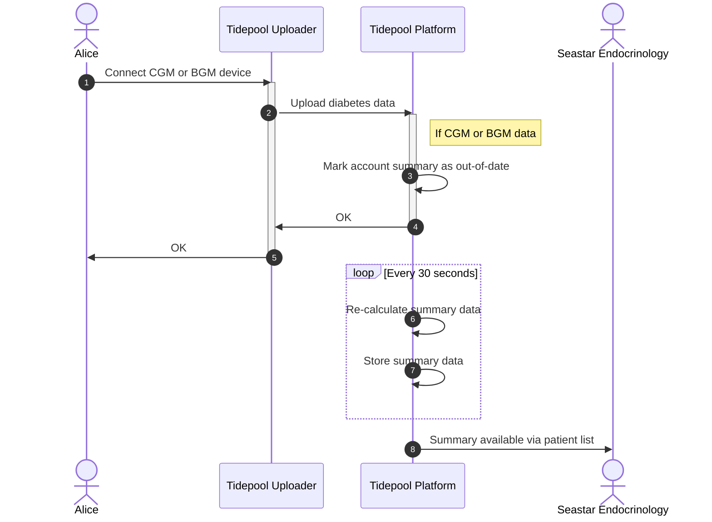
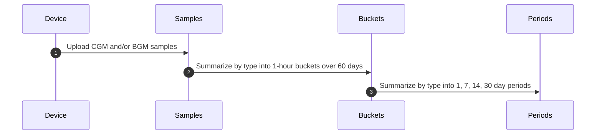
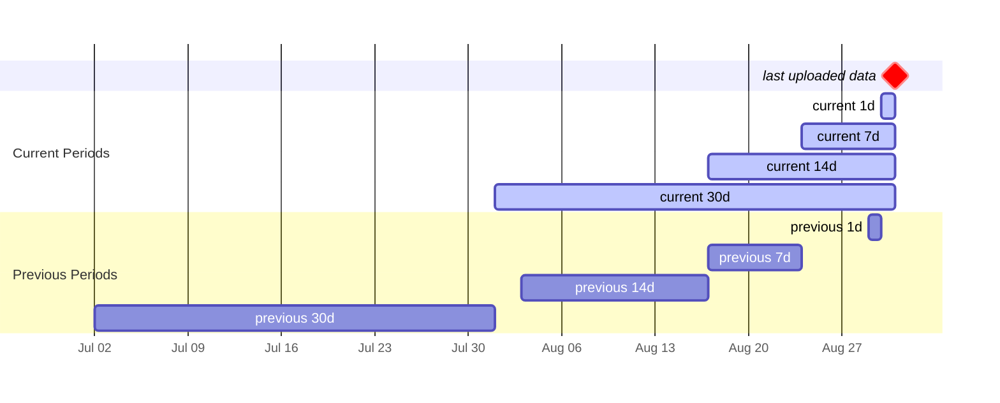

# Summary Statistics

## Overview

Tidepool Platform automatically calculates several summary statistics for each user as they upload diabetes data into their account. Currently supported data types are CGM and BGM, from [Continuous Glucose Monitors][cgm] and [Blood Glucose Meters][bgm], respectively. Our plan is to add insulin delivery summaries as well in the future.

The following diagram illustrates how the overall process works using manual [Tidepool Uploader][uploader] upload as an example. The same process applies regardless of how the data arrives in the user's account. Other examples are automatically uploading using [Tidepool Mobile][mobile], or via cloud-to-cloud import from [Dexcom Clarity][dexcom_clarity] or [Abbott LibreView][abbott_libreview], or even 3rd party applications such as [xDrip][xdrip].

**NOTE:** The summary calculation itself is nearly instantaneous. However, it is triggered by the arrival of new data so depending on the path of the upload it may take anywhere from few minutes to several hours for the summary statistics to be recalculated.

## Calculation

The summary calculation is done in batches of up to 250 most out-of-date user accounts, up to 4 batches in one iteration, where each iteration may begin every 30 seconds. Thus, each calculation iteration may update up to 1,000 accounts. The calculation for each user proceeds as shown in the diagram below:

Each user's data is first summarized into a set of 1-hour buckets separated by type (CGM or BGM) over the last 60 days, for a maximum of 1,440 buckets per type. The 60 day window is backwards from the date of the last uploaded data for each user, not the current date. The window may be shorter than 60 days of data if the user has not uploaded enough data. The window may also contain gaps.

The 1-hour buckets are then further summarized by type (CGM, BGM) into 1, 7, 14, and 30 day periods again backwards from the date of last uploaded data. In each period record, there is a delta record from the previous period of the corresponding duration. This enables period-over-period comparisons to support advanced dashboards such as _Stanford Timely Interventions for Diabetes Excellence_ or TIDE ([paper][tide]). The following diagram illustrates the relationship of the periods and the corresponding delta record.

Thus, a user who has both CGM and BGM data may have up to the following number of summary calculation artifacts:

<math display="block">
  <mtable columnalign="right left" columnspacing="0.5em">
    <mtr>
      <mtd>
        <mrow>
          <mrow>
            <mo>[</mo>
            <mtable>
              <mtr><mtd><mtext>CGM</mtext></mtd></mtr>
              <mtr><mtd><mtext>BGM</mtext></mtd></mtr>
            </mtable>
            <mo>]</mo>
          </mrow>
          <mtext> types </mtext>
          <mo>×</mo>
          <mn>60</mn>
          <mtext> days </mtext>
          <mo>×</mo>
          <mn>24</mn>
          <mspace width="0.3em"/>
          <mtext>hours</mtext>
        </mrow>
      </mtd>
      <mtd>
        <mrow>
          <mo>=</mo>
          <mn>2,880</mn>
          <mspace width="0.3em"/>
          <mtext>hourly buckets</mtext>
        </mrow>
      </mtd>
    </mtr>
    <mtr>
      <mtd>
        <mrow>
          <mrow>
            <mo>[</mo>
            <mtable>
              <mtr><mtd><mtext>CGM</mtext></mtd></mtr>
              <mtr><mtd><mtext>BGM</mtext></mtd></mtr>
            </mtable>
            <mo>]</mo>
          </mrow>
          <mtext> types </mtext>
          <mo>×</mo>
          <mrow>
            <mo>[</mo>
            <mtable orientation="horizontal">
              <mtr>
                <mtd><mn>1</mn></mtd>
                <mtd><mn>7</mn></mtd>
                <mtd><mn>14</mn></mtd>
                <mtd><mn>30</mn></mtd>
              </mtr>
            </mtable>
            <mo>]</mo>
          </mrow>
          <mspace width="0.3em"/>
          <mtext>days</mtext>
        </mrow>
      </mtd>
      <mtd>
        <mrow>
          <mo>=</mo>
          <mn>8</mn>
          <mspace width="0.3em"/>
          <mtext>periods</mtext>
        </mrow>
      </mtd>
    </mtr>
  </mtable>
</math>

All of the summary period data is stored within each user account to enable quick sorting and filtering in each clinic's patient list. If a user is a patient of multiple clinics, all clinics share the same summary data.

## Threshold Values

The summary calculation uses the glycemic targets established by [ADA][ada] [standards of care][ada_care] and [AACE][aace] ([paper][aace_paper], [table][aace_table]) to characterize each CGM or BGM glucose sample. The same target ranges are _currently_ used for all users, and not personalized based on the user's diagnosis type or either the user's or the clinic's preferences. The glycemic target ranges are listed in the table below. In addition to the discrete ranges, we also define two additional composite ranges _AnyLow_ and _AnyHigh_. Note also that the _VeryHigh_ range is inclusive of the _ExtremeHigh_ range.

<!-- unfortunately GitHub Markdown renderer strips all styles from HTML tables... -->
<!-- so these styles are only useful if rendering with some other Markdown renderer -->
<table style="text-align: center">
<colgroup>
<col style="background-color: #E0E0E0"/>
<!-- BG range colors from https://github.com/tidepool-org/blip/blob/develop/app/themes/baseTheme.js -->
<col style="background-color: #E9695E"/>
<col style="background-color: #F19181"/>
<col style="background-color: #8DD0A9"/>
<col style="background-color: #B69CE2"/>
<col style="background-color: #856ACF"/>
<col style="background-color: #5438A3"/>
</colgroup>
<thead>
<tr>
<th rowspan="2" style="font-style: italic">
Unit
</th>
<th colspan="2" style="background-image: linear-gradient(to right, #E9695E, #F19181)">

<em>AnyLow</em>
</th>
<th rowspan="2">

<em>Target</em>
</th>
<th colspan="3" style="background-image: linear-gradient(to right, #B69CE2, #856ACF, #5438A3)">

<em>AnyHigh</em>
</th>
</tr>
<tr>
<th>

<em>VeryLow</em>
</th>
<th>

<em>Low</em>
</th>
<th>

<em>High</em>
</th>
<th>

<em>VeryHigh</em>
</th>
<th>

<em>ExtremeHigh</em>
</th>
</tr>
</thead>
<tbody>
<tr>
<td>

mmol/L
</td>
<td>

<em>v < 3.0</em>
</td>
<td>

<em>3.0 ≤ v < 3.9</em>
</td>
<td>

<em>3.9 ≤ v ≤ 10.0</em>
</td>
<td>

<em>10.0 < v ≤ 13.9</em>
</td>
<td>

<em>v > 13.9</em>
</td>
<td>

<em>v ≥ 19.4</em>
</td>
</tr>
<tr>
<td>

mg/dL
</td>
<td>

<em>v < 54</em>
</td>
<td>

<em>54 ≤ v < 70</em>
</td>
<td>

<em>70 ≤ v ≤ 180</em>
</td>
<td>

<em>180 < v ≤ 250</em>
</td>
<td>

<em>v > 250</em>
</td>
<td>

<em>v ≥ 350</em>
</td>
</tr>
</tbody>
</table>

<!-- unfortunately stock GFM doesn't support 2-row colum headers >
|       Unit       | $VeryLow$ |      $Low$      |     $Target$     |      $High$       | $VeryHigh$ | $ExtremeHigh$ |
| :--------------: | :-------: | :-------------: | :--------------: | :---------------: | :--------: | :-----------: |
| $\frac{mmol}{L}$ | $v < 3.0$ | $3.0 ≤ v < 3.9$ | $3.9 ≤ v ≤ 10.0$ | $10.0 < v ≤ 13.9$ | $v > 13.9$ |  $v ≥ 19.4$   |
| $\frac{mg}{dL}$  | $v < 54$  |  $54 ≤ v < 70$  |  $70 ≤ v ≤ 180$  |  $180 < v ≤ 250$  | $v > 250$  |   $v ≥ 350$   |
-->

**NOTE:** Tidepool normalizes glucose samples to mmol/L units. If the original sample was in mg/dL units, it is converted using a conversion factor of 18.01559 derived from the molecular weight of glucose (C₆H₁₂O₆):

<math display="block">
  <mrow>
    <mn>12.01070</mn>
    <mfrac>
      <mi>g</mi>
      <mi>mol</mi>
    </mfrac>
    <mo>×</mo>
    <mn>6</mn>
    <mo>+</mo>
    <mn>1.00794</mn>
    <mfrac>
      <mi>g</mi>
      <mi>mol</mi>
    </mfrac>
    <mo>×</mo>
    <mn>12</mn>
    <mo>+</mo>
    <mn>15.99940</mn>
    <mfrac>
      <mi>g</mi>
      <mi>mol</mi>
    </mfrac>
    <mo>×</mo>
    <mn>6</mn>
    <mo>=</mo>
    <mn>180.1559</mn>
    <mfrac>
      <mi>g</mi>
      <mi>mol</mi>
    </mfrac>
  </mrow>
</math>

## Hourly Bucket Data Fields

Each bucket has a set of common fields, as well as a set of fields repeated for each of the 7 named summary ranges: _InLow_, _InTarget_, _InHigh_, _InVeryHigh_, _InExtremeHigh_, _InAnyLow_, and _InAnyHigh_. For brevity, in the following table the placeholder **Xxx** corresponds to those names rather than repeating each set of fields.

### GlucoseBucket

|  CGM  |  BGM  | Field                  | Type     | Unit             | Notes                                                                              |
| :---: | :---: | :--------------------- | :------- | :--------------- | :--------------------------------------------------------------------------------- |
|   ✅   |   ✅   | _Type_                 | _string_ |                  | Type of data in this bucket: `cgm` or `bgm`                                        |
|   ✅   |   ✅   | _Date_                 | _date_   |                  | Start time of the bucket                                                           |
|   ✅   |   ✅   | _LastRecordTime_       | _date_   |                  | Time of the last sample in the bucket                                              |
|   ✅   |       | _LastRecordDuration_   | _int_    | _min_            | Duration of the last sample in the bucket                                          |
|   ✅   |   ✅   | _Total.Glucose_        | _float_  | mmol/L | Sum of all samples in the bucket                                                   |
|   ✅   |       | _Total.Minutes_        | _int_    | _min_            | Sum of minutes covered by all samples in the bucket                                |
|   ✅   |   ✅   | _Total.Records_        | _int_    |                  | Count of all samples in the bucket                                                 |
|   ✅   |   ✅   | _**Xxx**.Glucose_ | _float_  | mmol/L | Sum of all samples within the thresholds of **Xxx** in the bucket                    |
|   ✅   |       | _**Xxx**.Minutes_| _int_    | _min_            | Sum of minutes covered by each sample within the thresholds of **Xxx** in the bucket |
|   ✅   |   ✅   | _**Xxx**.Records_ | _int_    |                  | Count of samples within the thresholds of **Xxx** in the bucket                      |

## Summary Period Data Fields

* _GlucosePeriod.GlucoseManagementIndicator_ is only present if _GlucosePeriod.Total.Percent > 70_
  * It is calculated using the [Jaeb formula][jaeb] to produce a GMI value in mmol/mol units, and then using the [NGSP formula][ngsp] to produce a % HbA1c value
  * It is rounded to one decimal point of precision
* _GlucosePeriod.Delta_ is not recursive: it is only present in the top-level _GlucosePeriod_
* _GlucosePeriod.Total_ is always present, but the threshold ranges are present only if:
  * _GlucosePeriod.DaysInPeriod ≤ 1_ and _GlucosePeriod.Total.Percent > 70_ or
  * _GlucosePeriod.DaysInPeriod > 1_ and _GlucosePeriod.Total.Minutes > 1,440_ (=24 hours)
* _GlucoseRange.Variance_ is only present in _GlucosePeriod.Total_

### GlucosePeriod

|  CGM  |  BGM  | Field                        | Type            | Unit             | Notes                                                            |
| :---: | :---: | :--------------------------- | :-------------- | :--------------- | :--------------------------------------------------------------- |
|   ✅   |   ✅   | _Type_                       | _string_        |                  | Type of data in this period: `cgm` or `bgm`                      |
|   ✅   |   ✅   | _DaysInPeriod_               | _int_           |                  | Number of days in this period: 1, 7, 14, or 30                   |
|   ✅   |   ✅   | _DaysWithData_               | _int_           |                  | Number of days where _Total.Records > 0_                         |
|   ✅   |   ✅   | _HoursWithData_              | _int_           |                  | Number of hours where _Total.Records > 0_                        |
|   ✅   |   ✅   | _Total_                      | _GlucoseRange_  |                  | Totals for all samples regardless of thresholds                  |
|   ✅   |   ✅   | _InVeryLow_                  | _GlucoseRange_  |                  |                                                                  |
|   ✅   |   ✅   | _InLow_                      | _GlucoseRange_  |                  |                                                                  |
|   ✅   |   ✅   | _InTarget_                   | _GlucoseRange_  |                  |                                                                  |
|   ✅   |   ✅   | _InHigh_                     | _GlucoseRange_  |                  |                                                                  |
|   ✅   |   ✅   | _InVeryHigh_                 | _GlucoseRange_  |                  |                                                                  |
|   ✅   |   ✅   | _InExtremeHigh_              | _GlucoseRange_  |                  |                                                                  |
|   ✅   |   ✅   | _InAnyLow_                   | _GlucoseRange_  |                  | _InVeryLow + InLow_                                              |
|   ✅   |   ✅   | _InAnyHigh_                  | _GlucoseRange_  |                  | _InHigh + InVeryHigh_ (this includes _InExtremeHigh_)            |
|   ✅   |   ✅   | _AverageDailyRecords_        | _float_         |                  | <math><mfrac><mi>Total.Records</mi><mi>DaysInPeriod</mi></mfrac></math>                             |
|   ✅   |   ✅   | _AverageGlucoseMmol_         | _float_         | mmol/L | <math><mfrac><mi>Total.Glucose</mi><mi>Total.Records</mi></mfrac></math>                            |
|   ✅   |       | _GlucoseManagementIndicator_ | _float_         | % HbA1c          | <math><mo>(</mo><mn>12.71</mn><mo>+</mo><mn>4.70587</mn><mo>×</mo><mi>AverageGlucose</mi><mo>)</mo><mo>×</mo><mn>0.09148</mn><mo>+</mo><mn>2.152</mn></math> |
|   ✅   |       | _StandardDeviation_          | _float_         | mmol/L | <math><msqrt><mfrac><mi>Total.Variance</mi><mi>Total.Minutes</mi></mfrac></msqrt></math>                    |
|   ✅   |       | _CoefficientOfVariation_     | _float_         |                  | <math><mfrac><mi>StandardDeviation</mi><mi>AverageGlucoseMmol</mi></mfrac></math>                   |
|   ✅   |   ✅   | _Delta_                      | _GlucosePeriod_ |                  | Deltas from the previous period of the same duration             |

### GlucoseRange

|  CGM  |  BGM  | Field      | Type    | Unit                 | Notes                                                                                                    |
| :---: | :---: | :--------- | :------ | :------------------- | :------------------------------------------------------------------------------------------------------- |
|   ✅   |   ✅   | _Glucose_  | _float_ | mmol/L     | Sum of all samples in the period                                                                         |
|   ✅   |       | _Minutes_  | _int_   | _min_                | Sum of minutes covered by each sample in the period                                                      |
|   ✅   |   ✅   | _Records_  | _int_   |                      | Count of samples in the period                                                                           |
|   ✅   |   ✅   | _Percent_  | _float_ | %                    | if <math><mrow><mi>Total</mi><mo>.</mo><mi>Minutes</mi><mo>≠</mo><mn>0</mn></mrow></math>: <math><mfrac><mrow><mi mathvariant="bold">Xxx</mi><mo>.</mo><mi>Minutes</mi></mrow><mrow><mi>Total</mi><mo>.</mo><mi>Minutes</mi></mrow></mfrac></math> or if <math><mrow><mi>Total</mi><mo>.</mo><mi>Records</mi><mo>≠</mo><mn>0</mn></mrow></math>: <math><mfrac><mrow><mi mathvariant="bold">Xxx</mi><mo>.</mo><mi>Records</mi></mrow><mrow><mi>Total</mi><mo>.</mo><mi>Records</mi></mrow></mfrac></math> |
|   ✅   |       | _Variance_ | _float_ | <math><msup><mrow><mo>(</mo><mfrac><mi>mmol</mi><mi>L</mi></mfrac><mo>)</mo></mrow><mn>2</mn></msup></math> | Calculated using [weighted incremental algorithm][variance]. |

## Handling Multiple Data Sources

In the event there are multiple CGM devices uploading data to the user's account, the initial 1-hour bucketing skips any excess data samples within a _blackout window_ defined relative to each data sample that is included in the bucket. Put another way, each data sample included in the bucket _masks_ any following excess data points until the blackout window expires.

In the following example there is a series of data samples in the current 1-hour bucket coming from a Dexcom G6 CGM which measures CGM every 5 minutes, and another hypotethical CGM device that provides data samples at 1 minute intervals.

| Time       | Device    | Action                                                                |
| ---------- | --------- | --------------------------------------------------------------------- |
| _xx:00:00_ | Dexcom G6 | **Included in calculation.** Sets blackout window to 5 minutes.       |
| _xx:00:30_ | Brand X   | Ignored within blackout window.                                       |
| _xx:01:30_ | Brand X   | Ignored within blackout window.                                       |
| _xx:02:30_ | Brand X   | Ignored within blackout window.                                       |
| _xx:03:30_ | Brand X   | Ignored within blackout window.                                       |
| _xx:04:30_ | Brand X   | Ignored within blackout window.                                       |
| _xx:05:00_ | Dexcom G6 | **Included in calculation.** Resets the blackout window to 5 minutes. |
| _xx:05:30_ | Brand X   | Ignored within blackout window.                                       |
| _xx:06:30_ | Brand X   | Ignored within blackout window.                                       |
| ...        | ...       | ...                                                                   |

The blackout windows are defined as 15 minutes for Abbott FreeStyle Libre devices, and 5 minutes for all other devices.

[ada]: https://diabetes.org/
[ada_care]: https://diabetesjournals.org/care/issue/46/Supplement_1
[aace]: https://pro.aace.com/
[aace_paper]: https://doi.org/10.1016/j.eprac.2022.08.002
[aace_table]: https://www.endocrinepractice.org/article/S1530-891X(22)00576-6/fulltext#tbl6
[tide]: https://pubmed.ncbi.nlm.nih.gov/39506045/
[jaeb]: https://www.jaeb.org/gmi/
[ngsp]: https://ngsp.org/ifcc.asp
[uploader]: https://www.tidepool.org/download
[mobile]: https://www.tidepool.org/download
[dexcom_clarity]: https://clarity.dexcom.com/
[abbott_libreview]: https://www.libreview.com/
[xdrip]: https://github.com/NightscoutFoundation/xDrip
[cgm]: https://diabetes.org/get-involved/advocacy/continuous-glucose-monitors
[bgm]: https://en.wikipedia.org/wiki/Glucose_meter
[variance]: https://en.wikipedia.org/wiki/Algorithms_for_calculating_variance#Weighted_incremental_algorithm
