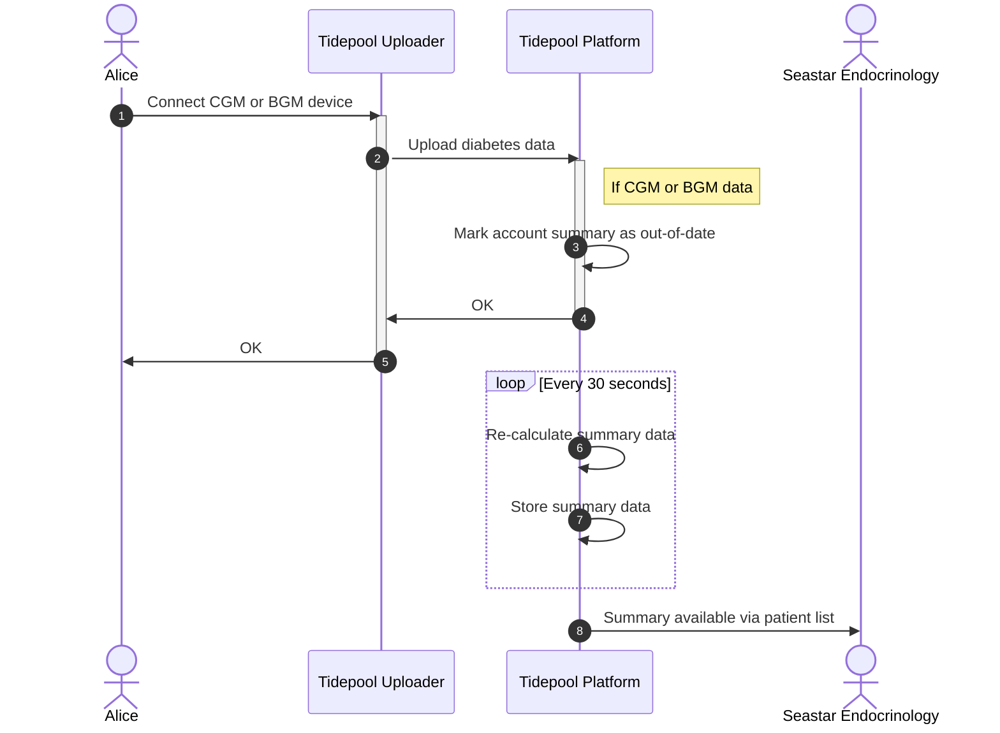
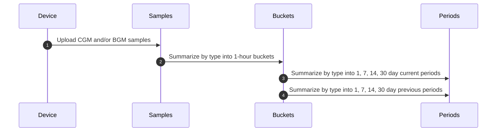
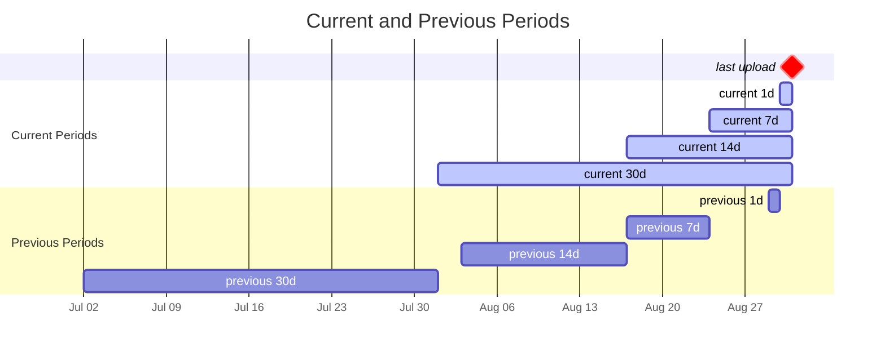

<!-- omit in toc -->
# Summary Statistics

<!-- omit in toc -->
## Table of Contents

1. [Overview](#overview)
2. [Calculation](#calculation)
   1. [Threshold Values](#threshold-values)
   2. [Hourly Bucket Data Fields](#hourly-bucket-data-fields)
   3. [Period Data Fields](#period-data-fields)
      1. [Summary Fields](#summary-fields)
      2. [CGM Usage](#cgm-usage)
      3. [Glucose Management Indicator](#glucose-management-indicator)
      4. [Range Measurements](#range-measurements)
   4. [Handling Multiple Data Sources](#handling-multiple-data-sources)

---

# Overview

Tidepool Platform automatically calculates several summary statistics for each user as they upload diabetes data into their account. Currently supported data types are CGM and BGM, from [Continuous Glucose Monitors](https://diabetes.org/get-involved/advocacy/continuous-glucose-monitors) and [Blood Glucose Meters](https://en.wikipedia.org/wiki/Glucose_meter), respectively. Our plan is to add insulin delivery summaries as well in the future.

The following diagram illustrates how the overall process works using [Tidepool Uploader](https://www.tidepool.org/download) as an example. The same process applies regardless of how the data appears in the user's account. Other examples are uploading using [Tidepool Mobile](https://www.tidepool.org/download), or automatically via import from [Dexcom Clarity](https://clarity.dexcom.com/), or even 3rd party applications such as [xDrip](https://github.com/NightscoutFoundation/xDrip).

# Calculation

The summary calculation is done in batches of up to 250 most out-of-date user accounts, up to 4 batches in one iteration, where each iteration may begin every 30 seconds. Thus, each calculation iteration may update up to 1,000 accounts. The calculation for each user proceeds as shown in the diagram below:

Each user's data is first summarized into a set of 1-hour buckets separated by type (CGM or BGM) over the last 60 days, for a maximum of 1,440 buckets. The 60 day window is backwards from the date of the last uploaded data for each user, not the present day. The window may be shorter than 60 days of data until the user uploads enough data to fill it. Finally, the window may contain gaps if the user has not uploaded data that fills each bucket.

The 1-hour buckets are then further summarized by type into two sets of current and previous 1, 7, 14, and 30 day periods. One set is for the _current periods_ based on the date of last upload. The second set is for the _previous periods_, that is offset relative to the earliest date of each _current_ period: 1 day for the 1 day period, 7 days for the 7 day period, and so on. This enables period-over-period comparisons to support advanced dashboards such as Stanford Timely Interventions for Diabetes Excellence (TIDE). The following diagram illustrates the layout of the periods.

Thus, in the end a user who has both CGM and BGM data may have up to the following number of summary calculation artifacts:

$$
\begin{align}
\begin{bmatrix}
  CGM \\
  BGM
\end{bmatrix} types
\times 30 \space days
\times 24 \space hours
\times \begin{bmatrix}
  current \\
  previous
\end{bmatrix} \space sets
& = 2,880 \space hourly \space buckets \nonumber \\
\begin{bmatrix}
  CGM \\
  BGM
\end{bmatrix} types
\times \begin{bmatrix}
  1 \\
  7 \\
  14 \\
  30
\end{bmatrix} \space days
\times \begin{bmatrix}
  current \\
  previous
\end{bmatrix} sets
& = 16 \space periods \nonumber
\end{align}
$$

All of the data is stored within each user account to enable quick sorting and filtering in each clinic's patient list. If a user is a patient of multiple clinics, all clinics share the same summary data.

## Threshold Values

The summary calculation uses the glycemic targets established by [ADA](https://diabetes.org/) [[standards of care](https://diabetesjournals.org/care/issue/46/Supplement_1)] and [AACE](https://pro.aace.com/) [[paper](https://doi.org/10.1016/j.eprac.2022.08.002), [table](https://www.endocrinepractice.org/article/S1530-891X(22)00576-6/fulltext#tbl6)] to characterize each CGM or BGM glucose value as one of very low, low, in range, high, or very high. The same target ranges are _currently_ used for all users, and not personalized based on the user's diagnosis type or either the user's or the clinic's preferences. The glycemic target ranges are:

|       Unit       | $VeryLow$ |      $Low$      |     $Target$     |      $High$       | $VeryHigh$ | $ExtremeHigh$ |
| :--------------: | :-------: | :-------------: | :--------------: | :---------------: | :--------: | :-----------: |
| $\frac{mmol}{L}$ | $v < 3.0$ | $3.0 ≤ v < 3.9$ | $3.9 ≤ v ≤ 10.0$ | $10.0 < v ≤ 13.9$ | $v > 13.9$ |  $v ≥ 19.4$   |
| $\frac{mg}{dL}$  | $v < 54$  |  $54 ≤ v < 70$  |  $70 ≤ v ≤ 180$  |  $180 < v ≤ 250$  | $v > 250$  |   $v ≥ 350$   |

Tidepool database stores glucose values in $\frac{mmol}{L}$ units using a conversion factor of 18.01559 if the original value was $\frac{mg}{dL}$.

We define two additional composite ranges:

* $AnyLow$ that covers the $VeryLow$ and $Low$ ranges
* $AnyHigh$ that covers the $High$, $VeryHigh$ and $ExtremeHigh$ ranges

## Hourly Bucket Data Fields

The data fields in each 1-hour bucket varies by the type of data: CGM or BGM. Each bucket has a set of common header fields:

|  CGM  |  BGM  | Field                | Type   | Unit  | Notes                                     |
| :---: | :---: | :------------------- | :----- | :---- | :---------------------------------------- |
|   ✅   |   ✅   | $Date$               | $date$ |       | Start time of the bucket                  |
|   ✅   |   ✅   | $LastRecordTime$     | $date$ |       | Time of the last record in the bucket     |
|   ✅   |       | $LastRecordDuration$ | $int$  | $min$ | Duration of the last sample in the bucket |

Each bucket contains a set of fields that repeat for each summarized range:

|  CGM  |  BGM  | Field      | Type    | Unit             | Notes |
| :---: | :---: | :--------- | :------ | :--------------- | :---- |
|   ✅   |   ✅   | $Glucose$  | $float$ | $\frac{mmol}{L}$ |       |
|   ✅   |       | $Minutes$  | $int$   | $min$            |       |
|   ✅   |   ✅   | $Records$  | $int$   |                  |       |
|   ✅   |   ✅   | $Percent$  | $float$ |                  |       |
|   ✅   |       | $Variance$ | $float$ |                  |       |

Combining the definitions above yields this general structure for the hourly buckets:

$$
\begin{align}
& Date \nonumber \\
& LastRecordTime \nonumber \\
& LastRecordDuration \nonumber \\
& \textbf{Xxx}.Glucose \nonumber \\
& \textbf{Xxx}.Minutes \nonumber \\
& \textbf{Xxx}.Records \nonumber \\
& \textbf{Xxx}.Percent \nonumber \\
& \textbf{Xxx}.Variance \nonumber
\end{align}
$$

The last 5 fields repeat 8 times, where $\textbf{Xxx}$ is substituted with $Total$, $InLow$, $InTarget$, $InHigh$, $InVeryHigh$, $InExtremeHigh$, $InAnyLow$, and $InAnyHigh$.

## Period Data Fields

The data fields in each period record varies by the type of source data, as shown in the table below. Each numerical data field is also accompanied by a corresponding delta field that shows the change between each current and previous period, or vice versa. For example:

$$
\begin{align}
current.TotalRecordsDelta & = current.TotalRecords - previous.TotalRecords \nonumber \\
previous.TotalRecordsDelta & = previous.TotalRecords - current.TotalRecords \nonumber
\end{align}
$$

### Summary Fields

|  CGM  |  BGM  | Field                         | Type    | Unit             | Notes                                          |
| :---: | :---: | :---------------------------- | :------ | :--------------- | :--------------------------------------------- |
|   ✅   |   ✅   | $HasTotalRecords$             | $bool$  |                  |                                                |
|   ✅   |   ✅   | $TotalRecords$                | $int$   |                  | Total number of records in the period          |
|   ✅   |   ✅   | $TotalRecordsDelta$           | $int$   |                  |                                                |
|   ✅   |   ✅   | $HasAverageDailyRecords$      | $bool$  |                  |                                                |
|   ✅   |   ✅   | $AverageDailyRecords$         | $float$ |                  | $\frac{TotalRecords}{DaysInPeriod}$            |
|   ✅   |   ✅   | $AverageDailyRecordsDelta$    | $float$ |                  |                                                |
|   ✅   |       | $DaysWithData$                | $int$   |                  | Number of days that have > 0 records           |
|   ✅   |       | $DaysWithDataDelta$           | $int$   |                  |                                                |
|   ✅   |       | $HoursWithData$               | $int$   |                  | Number of hours that have > 0 records          |
|   ✅   |       | $HoursWithDataDelta$          | $int$   |                  |                                                |
|   ✅   |   ✅   | $HasAverageGlucoseMmol$       | $bool$  |                  |                                                |
|   ✅   |   ✅   | $AverageGlucoseMmol$          | $float$ | $\frac{mmol}{L}$ | $\frac{TotalGlucose}{TotalRecords}$            |
|   ✅   |   ✅   | $AverageGlucoseMmolDelta$     | $float$ | $\frac{mmol}{L}$ |                                                |
|   ✅   |       | $StandardDeviation$           | $float$ | $\frac{mmol}{L}$ | $\sqrt{\frac{TotalVariance}{TotalMinutes}}$    |
|   ✅   |       | $StandardDeviationDelta$      | $float$ | $\frac{mmol}{L}$ |                                                |
|   ✅   |       | $CoefficientOfVariation$      | $float$ | $\frac{mmol}{L}$ | $\frac{StandardDeviation}{AverageGlucoseMmol}$ |
|   ✅   |       | $CoefficientOfVariationDelta$ | $float$ | $\frac{mmol}{L}$ |                                                |

### CGM Usage

|  CGM  |  BGM  | Field                    | Type    | Unit  | Notes |
| :---: | :---: | :----------------------- | :------ | :---- | :---- |
|   ✅   |       | $HasTimeCGMUsePercent$   | $bool$  |       |       |
|   ✅   |       | $TimeCGMUsePercent$      | $float$ | $\%$  |       |
|   ✅   |       | $TimeCGMUsePercentDelta$ | $float$ | $\%$  |       |
|   ✅   |       | $HasTimeCGMUseMinutes$   | $bool$  |       |       |
|   ✅   |       | $TimeCGMUseMinutes$      | $int$   | $min$ |       |
|   ✅   |       | $TimeCGMUseMinutesDelta$ | $int$   | $min$ |       |
|   ✅   |       | $HasTimeCGMUseRecords$   | $bool$  |       |       |
|   ✅   |       | $TimeCGMUseRecords$      | $int$   |       |       |
|   ✅   |       | $TimeCGMUseRecordsDelta$ | $int$   |       |       |

### Glucose Management Indicator

$GlucoseManagementIndicator$ is only calculated if $TimeCGMUsePercent > 70\%$ for any given period. It is calculated using [Jaeb formula](https://www.jaeb.org/gmi/) to produce a GMI value in $\frac{mmol}{mol}$, and then using [NGSP formula](https://ngsp.org/ifcc.asp) to produce a $\%HbA1c$ value, rounded to one decimal point of precision.

|  CGM  |  BGM  | Field                             | Type    | Unit       | Notes                                                            |
| :---: | :---: | :-------------------------------- | :------ | :--------- | :--------------------------------------------------------------- |
|   ✅   |       | $HasGlucoseManagementIndicator$   | $bool$  |            |                                                                  |
|   ✅   |       | $GlucoseManagementIndicator$      | $float$ | $\%Hb1A1c$ | $(12.71 + 4.70587 \times AverageGlucose) \times 0.09148 + 2.152$ |
|   ✅   |       | $GlucoseManagementIndicatorDelta$ | $float$ | $\%Hb1A1c$ |                                                                  |

### Range Measurements

The measurements repeat for each range: $InLow$, $InTarget$, $InHigh$, $InVeryHigh$, $InExtremeHigh$, $InAnyLow$, and $InAnyHigh$. The symbol $\textbf{Xxx}$ in the follwing table shows where the name of the range would appear.

These $Time\textbf{Xxx}$ field values are only calculated if the following conditions are met:

* for periods <= 1 day: if $TimeCGMUsePercent > 70\%$
* for periods > 1 day: if $TotalMinutes > 1,440 \space minutes$ (=24 hours)

|  CGM  |  BGM  | Field                          | Type    | Unit  | Notes |
| :---: | :---: | :----------------------------- | :------ | :---- | :---- |
|   ✅   |       | $HasTime\textbf{Xxx}Minutes$   | $bool$  |       |       |
|   ✅   |       | $Time\textbf{Xxx}Minutes$      | $int$   | $min$ |       |
|   ✅   |       | $Time\textbf{Xxx}MinutesDelta$ | $int$   | $min$ |       |
|   ✅   |   ✅   | $HasTime\textbf{Xxx}Percent$   | $bool$  |       |       |
|   ✅   |   ✅   | $Time\textbf{Xxx}Percent$      | $float$ | $\%$  |       |
|   ✅   |   ✅   | $Time\textbf{Xxx}PercentDelta$ | $float$ | $\%$  |       |
|   ✅   |   ✅   | $HasTime\textbf{Xxx}Records$   | $bool$  |       |       |
|   ✅   |   ✅   | $Time\textbf{Xxx}Records$      | $int$   |       |       |
|   ✅   |   ✅   | $Time\textbf{Xxx}RecordsDelta$ | $int$   |       |       |

## Handling Multiple Data Sources

In the event there are multiple CGM devices uploading data to the user's account, the initial 1-hour bucketing skips any excess data samples within a _blackout window_ defined relative to each data sample that is included in the bucket. Put another way, each data sample included in the bucket _masks_ any following excess data points until the blackout window expires.

In the following example there is a series of data samples in the current 1-hour bucket coming from a Dexcom G6 CGM which measures CGM every 5 minutes, and another hypotethical CGM device that provides data samples at 1 minute intervals.

| Time       | Device    | Action                                                                |
| ---------- | --------- | --------------------------------------------------------------------- |
| $xx:00:00$ | Dexcom G6 | **Included in calculation.** Sets blackout window to 5 minutes.       |
| $xx:00:30$ | Brand X   | Ignored within blackout window.                                       |
| $xx:01:30$ | Brand X   | Ignored within blackout window.                                       |
| $xx:02:30$ | Brand X   | Ignored within blackout window.                                       |
| $xx:03:30$ | Brand X   | Ignored within blackout window.                                       |
| $xx:04:30$ | Brand X   | Ignored within blackout window.                                       |
| $xx:05:00$ | Dexcom G6 | **Included in calculation.** Resets the blackout window to 5 minutes. |
| $xx:05:30$ | Brand X   | Ignored within blackout window.                                       |
| $xx:06:30$ | Brand X   | Ignored within blackout window.                                       |
| ...        | ...       | ...                                                                   |

The blackout windows are defined as 15 minutes for Abbott FreeStyle Libre devices, and 5 minutes for all other devices.
