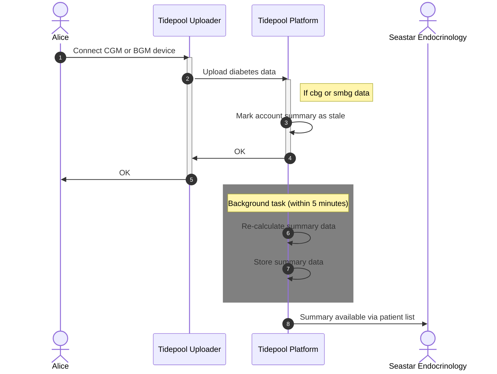

<!-- omit in toc -->
# Summary Statistics

<!-- omit in toc -->
## Table of Contents

1. [Overview](#overview)
2. [Calculation](#calculation)

---

# Overview

Tidepool Platform automatically calculates several summary statistics for each user as they upload diabetes data into their account. Currently supported data types are CGM (`cbg`) and BGM (`smbg`). Our plan is to add insulin pump summaries as well in the future.

The following diagram illustrates how the overall process works using Tidepool Uploader as an example. The same process applies regardless of how the data appears in the user's account. Other examples are uploading using Tidepool Mobile, or automatically via import from Dexcom Clarity, or even 3rd party applications such as xDrip.

# Calculation

The summary calculation is currently done in batches of 500 accounts at a time. The user's data is stored separated by type (`cbg` or `smbg`) in 1-hour buckets. In the event there are multiple CGM or BGM devices uploading data to the user's account, the current process selects the first device it finds in a given bucket.

<!-- theme: warning -->

> ## TODO 1
>
> Double-check these details with Alex.

The summary calculation uses the same standard threshold values for all users to characterize each `cbg` or `smbg` glucose value as very low, low, target, high, or very high value. This means the summary calculations are not personalized based on either the user's or the clinic's preferences. The threshold values are:

| Threshold              |   Value | Unit   |
| ---------------------- | ------: | ------ |
| `VeryLowBloodGlucose`  |  <= 3.0 | mmol/L |
| `LowBloodGlucose`      |  <= 3.9 | mmol/L |
| `HighBloodGlucose`     | >= 10.0 | mmol/L |
| `VeryHighBloodGlucose` | >= 13.9 | mmol/L |

Using these threshold values, the summary data is accummulated into 1-hour buckets over the last 30 days, for a total of 720 buckets. It is important to note that the 30 day window is backwards from the last date when the user uploaded data. The data in each bucket varies on the type of data:

|  `cbg`   |  `smbg`  | Field             | Type      | Unit    |
| :------: | :------: | ----------------- | --------- | ------- |
| &#10004; |          | `VeryLowMinutes`  | `int`     | minutes |
| &#10004; | &#10004; | `VeryLowRecords`  | `int`     |         |
| &#10004; |          | `LowMinutes`      | `int`     | minutes |
| &#10004; | &#10004; | `LowRecords`      | `int`     |         |
| &#10004; |          | `TargetMinutes`   | `int`     | minutes |
| &#10004; | &#10004; | `TargetRecords`   | `int`     |         |
| &#10004; |          | `HighMinutes`     | `int`     | minutes |
| &#10004; | &#10004; | `HighRecords`     | `int`     |         |
| &#10004; |          | `VeryHighMinutes` | `int`     | minutes |
| &#10004; | &#10004; | `VeryHighRecords` | `int`     |         |
| &#10004; | &#10004; | `TotalGlucose`    | `float64` | mmol/L  |
| &#10004; |          | `TotalMinutes`    | `int`     | minutes |
| &#10004; | &#10004; | `TotalRecords`    | `int`     |         |

These 1-hour buckets are then further summarized for periods of 1, 7, 14 and 30 days to produce the following values:

|  `cgm`   |  `smbg`  | Field                           | Type      | Unit     |
| :------: | :------: | ------------------------------- | --------- | -------- |
| &#10004; | &#10004; | `HasAverageGlucose`             | `bool`    |          |
| &#10004; |          | `HasGlucoseManagementIndicator` | `bool`    |          |
| &#10004; |          | `HasTimeCGMUsePercent`          | `bool`    |          |
| &#10004; | &#10004; | `HasTimeInLowPercent`           | `bool`    |          |
| &#10004; | &#10004; | `HasTimeInVeryLowPercent`       | `bool`    |          |
| &#10004; | &#10004; | `HasTimeInTargetPercent`        | `bool`    |          |
| &#10004; | &#10004; | `HasTimeInHighPercent`          | `bool`    |          |
| &#10004; | &#10004; | `HasTimeInVeryHighPercent`      | `bool`    |          |
| &#10004; |          | `TimeCGMUsePercent`             | `float64` | %        |
| &#10004; |          | `TimeCGMUseMinutes`             | `int`     | minutes  |
| &#10004; |          | `TimeCGMUseRecords`             | `int`     |          |
| &#10004; | &#10004; | `AverageGlucose`                | `float64` | mmol/L   |
|          | &#10004; | `TotalRecords`                  | `int`     |          |
| &#10004; |          | `GlucoseManagementIndicator`    | `float64` | mmol/mol |
| &#10004; | &#10004; | `TimeInVeryLowPercent`          | `float64` | %        |
| &#10004; |          | `TimeInVeryLowMinutes`          | `int`     | minutes  |
| &#10004; | &#10004; | `TimeInVeryLowRecords`          | `int`     |          |
| &#10004; | &#10004; | `TimeInLowPercent`              | `float64` | %        |
| &#10004; |          | `TimeInLowMinutes`              | `int`     | minutes  |
| &#10004; | &#10004; | `TimeInLowRecords`              | `int`     |          |
| &#10004; | &#10004; | `TimeInTargetPercent`           | `float64` | %        |
| &#10004; |          | `TimeInTargetMinutes`           | `int`     | minutes  |
| &#10004; | &#10004; | `TimeInTargetRecords`           | `int`     |          |
| &#10004; | &#10004; | `TimeInHighPercent`             | `float64` | %        |
| &#10004; |          | `TimeInHighMinutes`             | `int`     | minutes  |
| &#10004; | &#10004; | `TimeInHighRecords`             | `int`     |          |
| &#10004; | &#10004; | `TimeInVeryHighPercent`         | `float64` | %        |
| &#10004; |          | `TimeInVeryHighMinutes`         | `int`     | minutes  |
| &#10004; | &#10004; | `TimeInVeryHighRecords`         | `int`     |          |

Notes on the fields in the period summaries:

- `AverageGlucose` value is simply `TotalGlucose` divided by `TotalRecords`.
- The `TimeInXXX` values are only calculated if `TimeCGMUsePercent` is >70% for periods <= 1 day.
- The `TimeInXXX` values are only calculdate if `TotalMinutes` is >1440 minutes (=24 hours).
- `GlucoseManagementIndicator` value is only calculated if `TimeCGMUsePercent` for the period is >70%.
- `GlucoseManagementIndicator` value is calculated as `(12.71 + 4.70587 * AverageGlucose) * 0.09148 + 2.152`, rounded to one decimal point.

<!-- theme: warning -->

> ## TODO 2
>
> Double-check the GMI formula, source & unit with Alex. The first terms match Jaeb, the latter part is extra.
